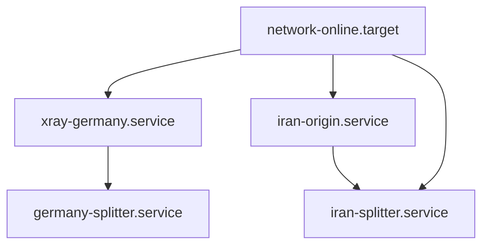

# T5 — systemd / service management (`internal/systemd`) — Design

**Status:** v1.1 — adversarial review round 1 applied (CRITICAL-1/2, HIGH-1/2
remediated; record in §11). Ready for CODE mode.
**Authority:** `docs/self-contained-deployment-architecture.md` (task table line 928:
T5 = `internal/systemd`: unit generation (EnvironmentFile D4, caps, ordering) +
enable/restart/health); staging ground truth audited live 2026-09-09.
**Base:** main `f0b44a2` (T4 merged).

---

## 1. Goal and non-goals

**Goal.** A hermetic, testable Go package `internal/systemd` that owns every
systemd-facing action of the product: unit generation (byte-pinned,
deterministic), env-file management (D4: no secret in unit files), user/state-dir
provisioning, transactional unit apply with rollback, enable/start/restart/stop,
bounded health waits, and read-only diagnostics. It is the service-management
half of the L5 acceptance path: after T5, the Germany staging host can be
provisioned end-to-end (xray-germany unit + germany-splitter unit + env file)
with zero hand-written units.

**Non-goals (explicit, to prevent scope bleed):**

| Concern | Owner |
|---|---|
| Firewall rules (ufw/nftables) | T6 (`internal/firewall`) |
| `splitterctl` CLI, deploy plan/apply orchestration, state-file JSON | T8 (`cmd/splitterctl`) / T6-T7 |
| Doctor checklist | T7 (`internal/doctor`) |
| Xray install/upgrade/keygen/config | T2/T3 (`internal/xray`) — already done |
| Origin (Caddy) install/Caddyfile/CDN transition | T4 (`internal/origin`) — already done |
| `install.sh` rewrite | T6 (D1: thin bootstrap) |

`internal/systemd` will be consumed by `cmd/splitterctl` (T8). The public API in
§6 is therefore the T8 integration contract: pure functions + one stateless
manager struct, every mutation takes `context.Context`, no package globals, no
goroutines.

## 2. What exists today (reuse-first findings)

- **Staging (audited live):** both hosts run Ubuntu 24.04.4 / kernel 6.8.0-138,
  units already use `EnvironmentFile=/etc/split-tunnel/<role>.env` (0600, with a
  `.bak-20` rollback file), binaries under `/opt/split-tunnel`, splitters enabled
  via `multi-user.target.wants` symlinks. **The D4 pattern is proven on staging.**
  Gaps observed: Germany `*:9002` (all interfaces — must be `127.0.0.1:9002`),
  Iran `*:9001` (must be `127.0.0.1:9001` behind the origin), no `xray-germany`
  unit, no non-root service user, no restart limits, no hardening directives.
- **Repo:** `systemd/{germany,iran}-splitter.service` templates (inline
  `SPLIT_SECRET=YOUR-SECRET-HERE` placeholders, `:9002` bare bind, no xray
  ordering); `install.sh install_systemd_service()` (lines 886–959) — the bash
  path T5 supersedes for the product path (stays as legacy/manual path in T5;
  templates are updated, script untouched).
- **Reusable T1–T4 seams (verified in source):**
  - `internal/config`: exported `Validate(role)` on a directly-constructed
    `Config` ("exported so tests and future non-env callers can validate a
    directly-constructed Config"); env-name constants (`EnvSocksListen`,
    `EnvSecret`, …) — T5 reuses both: **no validation rule duplicated**, no
    env-name string redeclared.
  - `internal/pairing.GenerateTunnelSecret()` — secret generation (T8 calls it;
    T5 only writes/validates).
  - `internal/xray`: `VersionDir(prefix, version)` layout; `ActivateParams`
    comment assigns T5 the creation of `/etc/split-tunnel`; test fixtures
    reference the `…/xray/current/xray` pointer path (T5 creates and manages
    it). **Permission-chain fact (verified in source, drives CRITICAL-1):**
    T3 writes the live config `0600 root:root` inside a `0700 root:root`
    dir, so a non-root service user cannot read it — T5 converges the chain
    (§4.8).
  - `internal/origin`: `Deps{Prefix,Dir}`; Caddy pinned at
    `<prefix>/caddy/<version>/caddy`; T4's live Caddyfile is `0600 root:root`
    in the project dir — same convergence needed for the non-root caddy
    service (§4.8); `XDG_DATA_HOME` is the coupling point for Caddy's ACME
    storage (see §4.5). T4 makes NO `systemctl` calls (verified) — unit
    management is unambiguously T5's, no duplication.
  - Established test pattern: `Executor`-interface injection with a
    `fakeExec` in tests, `OSExecutor` = `exec.Command`/`CommandContext` with
    separated args, golden-file + `goldenwrite` build tag, symlink-plant tests
    skipped on Windows, `excerpt` bounded output echoes. T5 follows it verbatim.
- **Architectural constraint:** `internal/archtest` gates pkg→internal
  imports. T5 lives in `internal/`, may import `internal/config`, must import
  nothing from `pkg/` and adds no new module dependencies (stdlib only).

## 3. Package layout

```
internal/systemd/
  systemd.go        package doc; Role/Component constants; Spec; Result; errors
  render.go         RenderUnit(spec) — deterministic unit renderer
  envfile.go        WriteEnvFile — D4 env file (0600), validated via internal/config
  user.go           EnsureUser, EnsureStateDir, EnsureLogDir, EnsureDataDir
  pointer.go        EnsureBinaryPointer — <prefix>/xray/current atomic symlink swap
  apply.go          ApplyUnit — the transactional unit install (with rollback)
  service.go        SystemdExecutor iface + OSExecutor; ServiceManager methods
  health.go         WaitActive, HealthCheck (is-active + metrics probe)
  uninstall.go      DisableUnit, RemoveUnit (T8 uninstall support)
  testdata/golden/  byte-pinned unit goldens (5 files; see §4.6)
  *_test.go         L1 hermetic tests (fake executor; no real systemd)
```

Repo root (scoped, CRITICAL-2): a new `.gitattributes` pins `eol=lf` for the
byte-pinned assets (see §4.13).

No goroutines anywhere. `WaitActive` polls on a `time.Ticker` in the caller's
goroutine and is fully ctx-bounded. Concurrency rule "every goroutine has a
defined termination path" is satisfied by construction (zero goroutines).

## 4. Design decisions

### 4.1 Roles, components, unit inventory

`Role` ∈ {`germany`, `iran`} (reuses `config.RoleGermany`/`config.RoleIran`
values). `Component` ∈ {`splitter`, `xray` (germany only), `origin` (iran
caddy/cdn modes)}. Generated unit files (all under `/etc/systemd/system`):

| Unit | Role | Purpose |
|---|---|---|
| `germany-splitter.service` | germany | up-carrier WS client, down-carrier listener `127.0.0.1:9002`, internet dialer |
| `xray-germany.service` | germany | pinned Xray core, VLESS+Reality inbound :443 → `127.0.0.1:9002` |
| `iran-splitter.service` | iran | SOCKS5 `127.0.0.1:10900`, up-carrier WS server `127.0.0.1:9001`, down-carrier dialer |
| `iran-origin.service` | iran | pinned Caddy reverse proxy for the up-carrier domain (caddy/cdn mode A) |

Fixed constants (NOT user inputs — eliminates a whole injection class):

```
unitDir   = /etc/systemd/system
wantsDir  = /etc/systemd/system/multi-user.target.wants
stateDir  = /etc/split-tunnel          (0750 root:split-tunnel — CONVERGED by T5; §4.8)
envPath   = /etc/split-tunnel/<role>.env (0600 root:root — systemd reads as root before Setuid)
logDir    = /var/log/split-tunnel      (0775 root:split-tunnel — the service must CREATE its own error-log file)
dataDir   = /var/lib/split-tunnel      (0755 split-tunnel:split-tunnel; Caddy ACME storage via XDG_DATA_HOME)
binaryPrefix = /opt/split-tunnel       (matches T2/T4 VersionDir prefix and staging)
```

### 4.2 Ordering (architecture doc §10.1 — `After=`/`Wants=`, never `Requires=`)



- Germany: `xray-germany` After/Wants `network-online.target`; `germany-splitter`
  After/Wants `xray-germany.service` **and** `network-online.target`.
- Iran: `iran-origin` After/Wants `network-online.target`; `iran-splitter`
  After/Wants `iran-origin.service` (only when origin mode ≠ none) and
  `network-online.target`. The splitter never hard-depends on the origin: if
  the origin dies, the splitter keeps running (Wants, not Requires/BindsTo).
- The Iran **existing** Xray/3x-ui is not project-managed → no unit reference;
  the Iran splitter's down-carrier dials it (dial-side resilience is the
  engine's job, not systemd's).

### 4.3 Restart policy, limits, hardening (doc §10.1, M6 bounded restart)

| Directive | splitter units | xray-germany | iran-origin (caddy) |
|---|---|---|---|
| `Restart` | `always` | `on-failure` | `on-failure` |
| `RestartSec` | `5` | `5` | `5` |
| `StartLimitIntervalSec` / `StartLimitBurst` | `300` / `10` | `300` / `10` | `300` / `10` |
| `RestartPreventExitStatus` | — | `23` | — |
| `User` / `Group` | `split-tunnel` | `split-tunnel` | `split-tunnel` |
| capabilities | none (all ports >1024) | `AmbientCapabilities=CAP_NET_BIND_SERVICE` + `CapabilityBoundingSet=CAP_NET_BIND_SERVICE` (binds 443) | same (binds 443 + 80) |
| `LimitNOFILE` | `65535` | `100000` | `65535` |
| hardening | `NoNewPrivileges`, `PrivateTmp`, `ProtectSystem=full`, `ProtectHome`, `ReadWritePaths=/var/log/split-tunnel` (xray only; splitters log to journal) | same | same + `ReadWritePaths=/var/lib/split-tunnel` + `Environment=XDG_DATA_HOME=/var/lib/split-tunnel` |
| `StandardOutput`/`StandardError` | journal / journal | journal / journal | journal / journal |
| `SyslogIdentifier` | `<unit-name>` | `xray-germany` | `iran-origin` |
| `StopSignal` | default `SIGTERM` (both splitter binaries explicitly handle SIGTERM — verified in `cmd/*/main.go`) | `SIGTERM` (xray core handles it) | `SIGTERM` |

Rationale notes:

- **Bounded restart loops on ALL units** (including the splitters): a
  crash-looping splitter that hit `Restart=always` forever would mask a bad
  binary. With `StartLimitBurst=10` in 300 s, systemd parks the unit in
  `failed` — observable by `HealthCheck`/doctor (T7) instead of an invisible
  spin. This refines (tightens) the doc's "splitter Restart=always" without
  weakening it: within the window the behavior is identical.
- `ProtectSystem=full` makes `/etc`, `/usr`, `/boot` read-only for the service:
  xray **reads** its config there (fine); it **writes** its error log to
  `/var/log/split-tunnel` (carved out via `ReadWritePaths`). Splitters write no
  files at runtime (state file is written by the root deploy CLI, not the
  service).
- No `CapabilityBoundingSet` on splitters: they bind only >1024 ports; the
  bounding set would drop even `CAP_NET_BIND_SERVICE` unnecessarily (splitters
  need nothing).
- Hardening list is conservative (systemd.best-practices tier 1). Anything
  beyond it (e.g. `SystemCallFilter`) is deliberately excluded until proven on
  staging in L5 — an unproven hardening directive that breaks the service at
  boot is worse than none.

### 4.4 D4: secret stays out of unit files (security)

- The renderer **structurally cannot emit secret-bearing lines**: the only
  environment mechanism in a generated unit is
  `EnvironmentFile=/etc/split-tunnel/<role>.env`. There is no `Environment=`
  line in any splitter unit (xray/origin units have no env lines at all except
  the caddy `XDG_DATA_HOME` path, which is not secret).
- `WriteEnvFile` writes `KEY=VALUE` lines (no quotes — values pass
  `internal/config.Validate` first, which already rejects whitespace in every
  endpoint value; the secret is 64-hex). File mode `0600 root:root` (systemd
  reads the file as root before dropping privileges — matches staging).
- **Never echo values in errors:** all T5 error strings are field-only
  (`SPLIT_SECRET: does not satisfy …` style, same contract as `internal/config`
  and `pairing.Redact`). A marker test (T1's
  `TestSecretNeverInOutputOrLogging` pattern) proves a 64-hex secret never
  appears in any error, unit byte string, or journal tail output.
- The golden files are audited by a test: no 32+-hex run anywhere in any
  rendered unit.

### 4.5 Env file content (reuse `internal/config` as the validator)

Germany env file keys (names taken from `config.Env*` constants — no drift):

```
SPLIT_UP_WS_URL=<wss://domain/upload>
SPLIT_DOWN_LISTEN=127.0.0.1:9002
SPLIT_SECRET=<64-hex>
SPLIT_METRICS_PORT=<m>
(+ optional tuning knobs: RELAY_BUF, CARRIER_GRACE, BOOTSTRAP_WAIT_MS,
   SESSION_BUFFER_BYTES, SESSION_BUFFER_TOTAL_BYTES, LIVENESS_ROUNDS —
   only when the caller supplies a non-zero value)
```

Iran env file keys: `SPLIT_SOCKS_LISTEN`, `SPLIT_WS_LISTEN`,
`SPLIT_DOWN_CARRIER_ADDR`, `SPLIT_SECRET`, `SPLIT_METRICS_PORT` (+ same optional
knobs).

**Validation = the existing validator.** T5 builds a `config.Config` from the
kv map and calls the exported `Validate(role)`; on failure the write is refused
and the returned `*config.ConfigError` already names every problem
field-only. This enforces the project rule "internal/config is the
authoritative configuration validator" and kills the class of bugs where the
unit/env writer drifts from the app's startup validation.

**Bind-address policy (closes the staging gap):** defaults are the code
defaults (`:9002` would be the code default — but T5 explicitly writes
`127.0.0.1:9002` / `127.0.0.1:9001` per the architecture doc topology and
RUNBOOK §2.2, which require loopback-only down-carrier and origin-fronted
up-carrier). The spec carries the values; the renderer does not re-validate
them (config.Validate does).

### 4.6 Unit renderer (deterministic, golden-pinned)

`RenderUnit(Spec) ([]byte, error)` produces, byte-for-byte, the goldens below
(LF, single trailing newline, tabs NOT used — systemd units use plain
whitespace; keys in a fixed order per section). Spec fields are validated at
render time (fail before any I/O):

- unit name matches `^[a-z0-9][a-z0-9-]*\.service$` (no `..`, no `.` tricks, no
  `.d/` override injection);
- `BinPath` is an absolute path, no whitespace, ≤ 4096 bytes;
- `Description` is a fixed constant per component (NOT an input — an
  input-driven description is an injection vector for zero operational value);
- no field accepts a value containing `\n` or `#` at line start.

**Fifth golden:** `Spec.OriginEnabled=false` for the iran splitter renders the
same unit with `After=`/`Wants=` reduced to `network-online.target` only —
committed as `iran-splitter.no-origin.golden.service` (no dangling
`Wants=iran-origin.service` when the origin mode is `none`). **Five** goldens
total; the golden test reads the committed bytes, normalizes CRLF→LF before
comparison, and asserts the renderer output is LF (CRITICAL-2, §4.13).

Goldens (committed under `internal/systemd/testdata/golden/`; goldens 1–4):

```ini
# germany-splitter.service
[Unit]
Description=germany-splitter (asymmetric split-tunnel)
After=network-online.target xray-germany.service
Wants=network-online.target xray-germany.service
StartLimitIntervalSec=300
StartLimitBurst=10

[Service]
Type=simple
User=split-tunnel
Group=split-tunnel
ExecStart=/opt/split-tunnel/germany-splitter
EnvironmentFile=/etc/split-tunnel/germany.env
Restart=always
RestartSec=5
LimitNOFILE=65535
NoNewPrivileges=true
PrivateTmp=true
ProtectSystem=full
ProtectHome=true
StandardOutput=journal
StandardError=journal
SyslogIdentifier=germany-splitter

[Install]
WantedBy=multi-user.target
```

```ini
# xray-germany.service
[Unit]
Description=Xray core (Germany down-carrier, VLESS+Reality)
After=network-online.target
Wants=network-online.target
StartLimitIntervalSec=300
StartLimitBurst=10

[Service]
Type=simple
User=split-tunnel
Group=split-tunnel
ExecStart=/opt/split-tunnel/xray/current/xray run -config /etc/split-tunnel/xray-germany.json
Restart=on-failure
RestartSec=5
RestartPreventExitStatus=23
AmbientCapabilities=CAP_NET_BIND_SERVICE
CapabilityBoundingSet=CAP_NET_BIND_SERVICE
LimitNOFILE=100000
NoNewPrivileges=true
PrivateTmp=true
ProtectSystem=full
ProtectHome=true
ReadWritePaths=/var/log/split-tunnel
StandardOutput=journal
StandardError=journal
SyslogIdentifier=xray-germany

[Install]
WantedBy=multi-user.target
```

```ini
# iran-splitter.service
[Unit]
Description=iran-splitter (asymmetric split-tunnel)
After=network-online.target iran-origin.service
Wants=network-online.target iran-origin.service
StartLimitIntervalSec=300
StartLimitBurst=10

[Service]
Type=simple
User=split-tunnel
Group=split-tunnel
ExecStart=/opt/split-tunnel/iran-splitter
EnvironmentFile=/etc/split-tunnel/iran.env
Restart=always
RestartSec=5
LimitNOFILE=65535
NoNewPrivileges=true
PrivateTmp=true
ProtectSystem=full
ProtectHome=true
StandardOutput=journal
StandardError=journal
SyslogIdentifier=iran-splitter

[Install]
WantedBy=multi-user.target
```

```ini
# iran-origin.service (caddy mode A)
[Unit]
Description=Caddy up-carrier origin (iran)
After=network-online.target
Wants=network-online.target
StartLimitIntervalSec=300
StartLimitBurst=10

[Service]
Type=simple
User=split-tunnel
Group=split-tunnel
Environment=XDG_DATA_HOME=/var/lib/split-tunnel
ExecStart=/opt/split-tunnel/caddy/v2.11.4/caddy run --config /etc/split-tunnel/Caddyfile --adapter caddyfile
Restart=on-failure
RestartSec=5
LimitNOFILE=65535
NoNewPrivileges=true
PrivateTmp=true
ProtectSystem=full
ProtectHome=true
ReadWritePaths=/var/lib/split-tunnel
StandardOutput=journal
StandardError=journal
SyslogIdentifier=iran-origin

[Install]
WantedBy=multi-user.target
```

Version in the caddy `ExecStart` path: `Spec` carries the origin version (T8
passes `origin.PinnedVersion`); the unit is rewritten on an origin version
change (a rare event; the restart cost is acceptable and documented). The xray
unit deliberately does NOT embed a version — it goes through the `current`
pointer (§4.7) so an xray version upgrade never rewrites the unit.

### 4.7 `xray/current` binary pointer (least-restart upgrades)

T2 installs to `<prefix>/xray/<version>/`. T5 adds `EnsureBinaryPointer`:

- target `<prefix>/xray/current` → `<prefix>/xray/<version>`;
- absent → create; already a symlink with the same target → no-op; different
  target → tmp symlink (`current.tmp-<pid>`, O_EXCL) + atomic rename;
- guards (T3/T4 pattern): the path must be absent, a symlink, or refused
  (regular file/dir → error); the resolved target must be a real directory
  strictly inside `<prefix>/xray/` (traversal/symlink-escape refused);
- `systemctl daemon-reload` is NOT needed for a pointer swap (only the unit
  file matters to systemd); the caller (T8) restarts `xray-germany.service`
  once.

### 4.8 User and directories

- `EnsureUser`: `id -u split-tunnel` via executor → exists: no-op (never
  mutates an existing user; a conflicting shell/group is reported in the
  `Result` warning list, not auto-fixed — auto-chowning user state is not
  reversible); absent: `useradd --system --group --shell /usr/sbin/nologin
  --home-dir /nonexistent --comment "split-tunnel service user" split-tunnel`.
- `EnsureStateDir`: `/etc/split-tunnel` — absent → `Mkdir 0750
  root:split-tunnel` + fsync; exists → must be a root-owned real dir (symlink
  → refused); **converge** to `0750 root:split-tunnel` (chgrp+chmod are
  safe on a root-owned dir). **CRITICAL-1 permission chain (non-root
  `xray-germany` must read its own config):** the live
  `xray-germany.json` and live `Caddyfile` are converged to `0640
  root:split-tunnel` (read for the service group); the `.prev`/`.tmp`
  rollback artifacts are left `0600 root:root` (they contain previous
  Reality private keys — root-only is correct). **Invariant:** T3's
  `ActivateGermanyConfig` rewrites the live config as `0600 root:root`, so
  T8 MUST run `EnsureStateDir` convergence after every xray (re)activation
  and before every xray `ApplyUnit`/restart — documented in the §6 contract
  and enforced by a test that simulates the T3 write-then-apply sequence.
- `EnsureLogDir`: `/var/log/split-tunnel` `0775 root:split-tunnel` (xray's
  error log path comes from the T3 golden config — the dir must exist and be
  service-**writeable** — the service creates the log file itself, so the
  group `w` bit is mandatory; 0755 would break the unit. Enforced in the
  preflight of the xray apply).
- `EnsureDataDir`: `/var/lib/split-tunnel` 0755 `split-tunnel:split-tunnel`
  (Caddy ACME storage via `XDG_DATA_HOME`; only ensured for the iran origin
  unit).

### 4.9 `ApplyUnit` — the transaction (mandated sequence)

```
preflight → desired state → candidate prep → validation → backup →
activation → service transition → health verification → [rollback on failure]
```

1. **Preflight.** `RootCheck()` (injectable; default `os.Geteuid()==0`); unit
   path is a constant; `BinPath` exists and is a regular executable (a unit
   that enables against a missing binary fails at boot — refuse now); if the
   spec references the env file, it exists with mode ≤ 0640 and owner root
   (write it first in T8's flow; T5 does not auto-create env files); for the
   xray unit: `EnsureStateDir` + `EnsureLogDir` done (T8 order, but `ApplyUnit`
   re-asserts the dirs exist — fail fast, do not create side effects mid-apply).
2. **Desired state.** `RenderUnit(spec)` (pure).
3. **Candidate prep.** `Lstat` the live path: if it exists it must be a regular
   file (symlink/non-regular → refused). If live bytes == desired bytes →
   **no-op path**: zero writes, a READ-ONLY `HealthCheck` (never WaitActive —
   a no-op apply must never block on a slow-starting unit or mutate anything)
   fills `Result{Unchanged:true, Restarted:false}` (idempotence +
   least-restart, the key T5 guarantee). Otherwise write
   `<unit>.tmp-<pid>` O_EXCL 0644 root:root + fsync.
4. **Validation.** `systemd-analyze verify <live-path-or-candidate>` (verifies
   syntax AND that referenced binaries/users exist on Ubuntu 24.04). Non-zero
   exit → remove candidate, error with bounded `excerpt` of the output
   (T2/T3 pattern), nothing touched.
5. **Backup.** live unit → `<unit>.bak-<unixnano>` (0644). Keep the **latest
   3** managed backups (sweep older ones matching the managed prefix; never
   touch foreign files).
6. **Activation.** `rename(candidate → live)` + dir fsync. (Same filesystem —
   guaranteed by the fixed unit dir.)
7. **Service transition.** `daemon-reload` → `enable <unit>` (idempotent) →
   if state was active: `restart`; else: `start`.
8. **Health verification.** `WaitActive(ctx, unit, 10 s)`: poll `is-active`
   every 250 ms. **HIGH-2 semantics:** `systemctl is-active` reports
   `activating (auto-restart)` for a crash-looping binary during `RestartSec`
   — only the exact state `active` (first word) is a success; `activating` is
   NOT success and keeps polling until the unit is `active` or the deadline
   expires; `failed` → immediate failure; ctx deadline → failure.
9. **Rollback** (pre-swap failures need none; 7/8 failures do). **HIGH-1 —
   two cases:** (a) `hadPrevious=true`: restore the backup over the live
   path (atomic: backup→tmp→rename), `daemon-reload`, `restart`
   (best-effort, bounded, errors appended not swallowed); (b)
   `hadPrevious=false` (fresh install): a failing fresh install must NOT
   leave an enabled unit pointing at a broken binary (it would crash-loop at
   every boot) — rollback = remove the unit file + `disable` +
   `daemon-reload`, i.e. converge to the "not deployed" state. Both paths
   return a structured error naming the failed step and the rollback
   outcome. Crash state: a leftover `<unit>.tmp-<deadpid>` is swept in the
   next preflight **only if the encoded pid is not alive** (injected
   `PidAlive func(int) bool`; default `/proc/<pid>/stat` lstat on Linux,
   fakes must implement the call, never hardcode); a live pid →
   `ErrApplyInProgress` (fail closed — another apply is running).
10. **State commit.** T5 returns `Result{Unit, Hash(SHA-256 of live bytes),
    Restarted, Health, Warnings}`. The `/etc/split-tunnel` state **file**
    (architecture doc §7.2) is owned by the deploy layer (T6/T8) — T5 gives it
    the hash to record. Boundary documented, not duplicated.

### 4.10 `ServiceManager` and health

`SystemdExecutor` interface (T5's analog of `xray.Executor`):

```go
type SystemdExecutor interface {
    Run(ctx context.Context, args ...string) (string, error)
}
// OSExecutor: exec.CommandContext("systemctl"|"useradd"|"id"|
// "systemd-analyze", args...) — separated args, NEVER a shell.
```

`ServiceManager{Ex SystemdExecutor; RootCheck func() error; PidAlive func(int) bool}`
methods: `Reload`, `Enable`, `Disable`, `Start`, `Stop`, `Restart`,
`IsEnabled`, `State(unit) → "active"|"activating"|"failed"|"inactive"|"unknown"`,
`WaitActive(ctx, unit, timeout)`, `JournalTail(ctx, unit, n) (string, error)`
(`journalctl -u <unit> -n <n> --no-pager -q -o short-iso`; read-only, bounded;
n capped at 200; output passes through no secret transformation — the secret
is never in the journal because it is never in the unit/env echo paths —
asserted by test).

`HealthCheck(ctx, unit, metricsPort) → Health{Unit, Active, MetricsOK, State,
Error}`: `is-active` + (if metricsPort > 0) `GET
http://127.0.0.1:<port>/metrics` with a 2 s deadline expecting HTTP 200.
Pure read-only; never starts or restarts anything (doctor semantics, T7
reuses this).

### 4.11 Uninstall support (for T8)

`DisableUnit(ctx, unit)`: stop (if active) → disable → remove the wants symlink.
`RemoveUnit(ctx, unit)`: `DisableUnit` + back up the unit file to
`/etc/split-tunnel/units-backup/<unit>.<unixnano>` (bounded 3) + remove it +
`daemon-reload`. Never removes binaries, env files, state, or logs (the deploy
layer owns those; documented).

### 4.12 Shipped template + doc updates (same task, no script change)

- `systemd/germany-splitter.service`, `systemd/iran-splitter.service`:
  regenerated to the renderer's goldens **with the manual-path env-file
  contract** (`EnvironmentFile=/etc/split-tunnel/<role>.env` + a comment
  block: create the 0600 env file with the `SPLIT_*` keys first — the inline
  `SPLIT_SECRET=YOUR-SECRET-HERE` placeholder line is GONE).
- New `systemd/xray-germany.service` template (golden copy).
- `README.md`: manual-deploy section updated (D4 env-file instruction,
  loopback bind note, "product path = splitterctl (T8), templates = manual
  fallback").
- `IMPLEMENTATION_STATUS.md`: T5 record appended; **stale T4 header fixed**
  ("pending PR + Linux CI merge" → merged at `f0b44a2`); header block updated
  to the real current branch/base.

### 4.13 Line endings / byte stability (CRITICAL-2)

The repo has no `.gitattributes`, and the audit found exactly this failure
mode in the worktree (a golden "modified" with textually identical content —
CRLF drift on the Windows/OneDrive dev host). T5 therefore:

- adds a **scoped** `.gitattributes` at the repo root: `eol=lf` for
  `*.service`, `internal/systemd/testdata/`, `internal/xray/testdata/`,
  `internal/origin/testdata/`, and `*.golden.*` — byte-pinned assets only,
  nothing else touched (minimal blast radius);
- the golden test normalizes the committed bytes CRLF→LF before comparing
  (defensive on both platforms), and asserts the renderer output contains no
  `\r` (canonical form = LF);
- `goldenwrite` always writes LF.

## 5. Security properties (and their proofs)

| Property | Mechanism | Test |
|---|---|---|
| Secret never in unit bytes | renderer has no value-carrying `Environment=`; goldens audited | `TestRenderedUnitsContainNoSecretMaterial` (32-hex run scan + explicit marker) |
| Secret never in errors/journal | field-only errors (config validator + T5 errors); env values never logged | marker test: plant a `SECRETMARKER…` 64-hex value in kv → assert absent from error strings |
| No shell interpolation | `exec.CommandContext(name, args…)` only | code inspection + no `sh -c` string in the package (grep test) |
| Path injection / traversal | all managed paths are constants; unit name regex; BinPath absolute-no-whitespace; pointer target must resolve inside prefix | adversarial specs rejected, no I/O |
| Symlink attack on any managed object | Lstat + refuse (unit, env, state dir, pointer, backup target) | plant tests (skip on Windows) |
| Concurrent apply | `<tmp-<pid>>` + `PidAlive` gate; `ErrApplyInProgress` | fake pid-alive matrix |
| Unbounded backups (disk exhaustion) | keep-latest-3 sweep, managed-prefix only | 7 applies → ≤3 backups, foreign files untouched |
| Boot-fail from missing binary | preflight checks ExecStart target exists+regular | fake fs matrix |
| Privilege | `RootCheck` gate on every mutating op; service runs non-root `split-tunnel`; `NoNewPrivileges` | unit goldens + RootCheck test |
| Crash-state residue | managed tmp/backup sweep only; foreign files never touched | crash-state tests (T4 pattern) |

## 6. Public API (T8 integration contract)

```go
package systemd

type Role string        // config.RoleGermany / config.RoleIran values
type Component string  // "splitter" | "xray" | "origin"

type Spec struct {
    Role       Role
    Component  Component
    BinPath    string   // absolute, preflight-checked
    EnvFile    string   // role constant; "" for xray
    UnitName   string   // derived default; overridable within the name regex
    Description string  // ignored (fixed per component) — documented trap
    // origin-only:
    OriginVersion string
    // iran splitter: false → no reference to iran-origin.service (5th golden)
    OriginEnabled bool
    // units that MUST exist (as files) before apply (preflight-enforced):
    // e.g. germany-splitter → ["xray-germany.service"]
    RequiresUnits []string
}

type Result struct {
    Unit      string
    Hash      string // sha256 of the live unit bytes
    Unchanged bool
    Restarted bool
    Health    Health
    Warnings  []string
}

func RenderUnit(s Spec) ([]byte, error)
func WriteEnvFile(ctx context.Context, role Role, kv map[string]string) (applied bool, hash string, err error)
func RollbackEnvFile(ctx context.Context, role Role) error // restore the .bak; T8 composes env↔unit rollback atomically (the env is consumed at service start, so it must roll back with the unit)
func EnsureUser(ctx context.Context, ex SystemdExecutor) error
func EnsureStateDir(ctx context.Context) error
func EnsureLogDir(ctx context.Context, ex SystemdExecutor) error
func EnsureDataDir(ctx context.Context, ex SystemdExecutor) error
func EnsureBinaryPointer(ctx context.Context, kind, version string) error
func ApplyUnit(ctx context.Context, m *ServiceManager, s Spec) (Result, error)
func RollbackLast(ctx context.Context, m *ServiceManager, s Spec) error
func DisableUnit(ctx context.Context, m *ServiceManager, s Spec) error
func RemoveUnit(ctx context.Context, m *ServiceManager, s Spec) error
func HealthCheck(ctx context.Context, m *ServiceManager, s Spec, metricsPort int) (Health, error)
type ServiceManager struct{ Ex SystemdExecutor; RootCheck func() error; PidAlive func(int) bool }
func NewServiceManager(ex SystemdExecutor) *ServiceManager // defaults injected
// ServiceManager methods: Reload, Enable, Disable, Start, Stop, Restart,
// IsEnabled, State, WaitActive, JournalTail
```

Rules: no global state; every mutating op is ctx-bounded and root-checked;
every error is field-only (no values); no `pkg/` imports. OS-level defaults
(`chown`/`chgrp`, `/proc` pid liveness, the real `OSExecutor`) are
Linux-gated (`runtime.GOOS == "linux"` — the target platform); the fakes keep
L1 fully cross-platform on the Windows dev host. `State()` parses the first
word of `systemctl is-active` output exactly; "activating" is never success
(HIGH-2).

## 7. Test plan (L1 hermetic — the entire L2 "fake systemctl shim" tier)

All tests run on Windows AND Linux CI (symlink tests skip on Windows, the
established pattern). Fake executor = ordered call log + canned outputs.

1. **Golden:** 5 unit goldens (4 + iran-splitter.no-origin) + determinism
   (100 renders → 1 byte string) + CRLF-normalized comparison (golden bytes
   normalized CRLF→LF; renderer output asserted LF-only) + `goldenwrite`
   regeneration test (build tag, T3/T4 pattern).
2. **Renderer rejection matrix:** bad unit names (`../x.service`, `x.d/y`,
   uppercase, empty), non-absolute/whitespace BinPath, role/component combos
   that don't exist (iran+xray → error).
3. **Env file:** fresh write 0600 + content exact; idempotent no-op
   (identical kv → no fs writes, `applied=false`); changed kv → tmp+rename +
   `.bak` (keep-3 sweep at 4 changes); invalid kv (placeholder secret,
   `:9002` for a dial-target, port collision) → `*config.ConfigError`
   propagated, file untouched; secret-marker absent from error.
4. **ApplyUnit sequence (happy):** assert the EXACT executor call order
   (verify → daemon-reload → enable → start → is-active×1) and fs effects
   (backup exists, candidate gone, live bytes == desired, mode 0644).
5. **ApplyUnit idempotent:** second apply → zero executor calls,
   `Unchanged=true`, mtime unchanged.
6. **ApplyUnit rollback matrix:** (a) `systemd-analyze verify` fails →
   nothing on disk changed, no backup; (b) `daemon-reload` fails post-swap →
   backup restored byte-identical + reload retried + error names the step;
   (c) `WaitActive` sees `failed` → full rollback + old unit restarted;
   (d) ctx canceled mid-transaction → no partial state (T4's cancel pattern).
7. **Crash state:** stale `.tmp-<deadpid>` swept; `.tmp-<livepid>` →
   `ErrApplyInProgress`; foreign `.tmp-other` untouched.
8. **Symlink plants:** unit path, env path, state dir, pointer path,
   backup target (5 tests, Windows-skip).
9. **Pointer:** create / no-op same-target / swap different-target / refuse
   regular file / refuse escape-target (`/etc/passwd`) / refuse `..`.
10. **User:** exists → no `useradd` (call log empty beyond `id`); absent →
    exact `useradd` args asserted.
11. **WaitActive:** activating×3→active (success, call count exact);
    `failed` → immediate; deadline → `context.DeadlineExceeded` — all via
    fake counters, zero wall-clock sleeps.
12. **HealthCheck:** active+200 → OK; active+conn-refused → `MetricsOK=false`;
    metricsPort=0 → probe skipped.
13. **JournalTail:** n>200 capped; output never contains the planted secret
    marker (fake journal output contains it → T5 must NOT pass env file bytes
    to it — assert the call args never include the env path).
14. **Grep tests:** no `os/exec` with `"sh"`; no `fmt` of kv values outside
    the env-file writer; no goroutines (`go func` count == 0 in non-test files).
15. **archtest:** unchanged gate passes (internal→internal/config import is
    legal; pkg untouched).
16. **Fresh-install rollback (HIGH-1):** health fails on first-ever apply →
    unit removed + disabled + reloaded; a second fresh apply succeeds
    (convergence); no wants symlink left behind.
17. **State semantics (HIGH-2):** fake `is-active` returns
    "activating (auto-restart)" → not success; "active" → success;
    "failed" → immediate failure (call counts exact).
18. **Permission-chain convergence (CRITICAL-1):** simulate the T3
    write-then-apply sequence (live config written 0600 root:root by a
    T3-style fixture) → after `EnsureStateDir` + apply, the live config is
    0640 root:split-tunnel, the dir 0750 root:split-tunnel, the log dir 0775
    root:split-tunnel; `.prev` stays 0600 root:root.

**L2+ note (for T6/T8, not this task):** the same fakes + a real
`systemctl` shim container test is how the architecture doc's L2 tier runs;
T5's package is already shim-ready because `SystemdExecutor` is the seam.

## 8. Rollback / failure semantics summary

| Failure | State after | Operator sees |
|---|---|---|
| preflight (non-root, missing bin, foreign object) | nothing | field-only error |
| config validation (env) | env file untouched | `ConfigError` problems list |
| render/spec invalid | nothing | error names the spec field |
| `systemd-analyze verify` | nothing (candidate removed) | bounded xray/systemd excerpt |
| swap/daemon-reload/enable/start (upgrade) | old unit restored + reloaded + restarted (best effort) | error names step + rollback outcome |
| fresh install: daemon-reload/enable/start/health fails | unit removed + disabled + reloaded (converges to "not deployed") | error names step + rollback outcome |
| health wait (failed/timeout) | same as above | `Result.Health` + step |
| crash mid-apply | next apply sweeps managed residue; old unit may be live-but-unverified → doctor (T7) flags via hash mismatch with last `Result.Hash` | journal + doctor |

## 9. Risks / open questions (to close in review)

- **R1** `systemd-analyze verify` exit semantics on warnings: Ubuntu 24.04
  returns 0 on non-fatal warnings; treat any non-zero as failure (fail
  closed), bounded excerpt in the error. Accepted.
- **R2** Caddy ACME storage via `XDG_DATA_HOME` vs an explicit JSON
  `storage.root`: T4's Caddyfile renderer does not emit a storage block, so
  the XDG path is the effective location; if T4 later emits one, the unit's
  `ReadWritePaths` must be reconciled — flagged for T4/T8 review, no T5
  change now.
- **R3** `useradd` vs `usermod` when the user pre-exists with a wrong shell:
  T5 reports and refuses (no silent mutation) — operator action required;
  doctor (T7) surfaces it. Accepted (reversibility > convenience).
- **R4** Iran-side existing Xray (3x-ui): deliberately NOT ordered into
  `iran-splitter.service` (foreign service). Boot ordering there is a
  RUNBOOK note, not a unit directive.
- **R5** The shipped `systemd/*.service` templates are also consumed by
  `install.sh` (manual path) — the template update (D4 env file) changes the
  manual path's contract; `install.sh` still writes its own unit (legacy,
  superseded in T6). README warning text updated so no operator is surprised.

## 10. Definition of done (T5)

1. `internal/systemd` implemented per §3/§6, stdlib-only, zero goroutines.
2. All §7 tests green on Windows locally AND Linux CI (`go test -race`).
3. `systemd/` templates updated + new `xray-germany.service` template; README
   + IMPLEMENTATION_STATUS.md (incl. stale T4 header fix) synchronized.
4. Adversarial architect review gate: CRITICAL=0, HIGH=0, MEDIUMs
   fixed-or-accepted with rationale recorded.
5. Worktree anomalies from the audit resolved (`git checkout --` the drifted
   golden; delete the untracked T4 scratch checksum file) — done as the first
   commit on the T5 branch so the diff is reviewable.
6. Scoped `.gitattributes` (eol=lf for byte-pinned assets) committed.

## 11. Adversarial review record (round 1 — design)

**Scope attempted:** non-root permission chains, systemd ordering/state
semantics, golden byte-stability across Windows/Linux, crash-state and
concurrency, injection surfaces, secret leakage, rollback completeness,
scope-bleed vs T6/T7/T8, dependency duplication vs T4, boot failure modes.

| # | Severity | Finding | Disposition |
|---|---|---|---|
| 1 | CRITICAL | Non-root `xray-germany` cannot read its config: T3 writes the live config 0600 root:root inside a 0700 root:root dir (source-verified); `User=split-tunnel` would fail to start. Staging works today only because it runs root. | FIXED §4.1/§4.8: state dir 0750 root:split-tunnel, live config/Caddyfile converged to 0640 root:split-tunnel, .prev/.tmp stay 0600 root:root; invariant documented for the T3-re-activation path (T8 re-converges after each activation); test 18. |
| 2 | CRITICAL | Golden byte-stability: no `.gitattributes`; the audit already found CRLF drift in the worktree (content-identical "modified" golden). Byte-pinned units would flake across hosts. | FIXED §4.6/§4.13: scoped `.gitattributes` eol=lf for byte-pinned assets + CRLF-normalizing comparison + LF assertion + goldenwrite LF. |
| 3 | HIGH | Fresh-install rollback undefined: a failing first apply would leave an enabled unit on a broken binary → boot crash-loop, no backup to restore. | FIXED §4.9 step 9(b): remove + disable + reload → "not deployed"; test 16; §8 row. |
| 4 | HIGH | `is-active` reports `activating (auto-restart)` for a crash-looping binary during RestartSec; loose parsing would let WaitActive pass a broken unit. | FIXED §4.9 step 8 + §6: exact first-word `active` only; test 17. |
| 5 | MEDIUM | Idempotent apply path used WaitActive (a no-op could block 10 s on a slow unit). | FIXED §4.9 step 3: read-only HealthCheck on the no-op path. |
| 6 | MEDIUM | The env file is consumed at service start, so a unit rollback alone leaves a mismatched env (rollback hole). | FIXED §6: `RollbackEnvFile` partner API; T8 composes the pair atomically. |
| 7 | MEDIUM | OS-dependent ops (chown, /proc pid check, OSExecutor) would not compile/run on the Windows dev host. | FIXED §6: Linux-gated defaults; fakes keep L1 cross-platform. |
| 8 | MEDIUM | Dangling `Wants=iran-origin.service` when the origin mode is none. | FIXED §4.6: `Spec.OriginEnabled`; 5th golden. |
| 9 | MEDIUM | germany-splitter could enable while xray-germany.service is absent (boot failure). | FIXED §6: `Spec.RequiresUnits` enforced in preflight. |
| 10 | ACCEPTED | Caddy admin API at default localhost:2019 (unproven-hardening risk). | Accepted: local-only, no unit change; T7 doctor reports it. |
| 11 | ACCEPTED | `network-online.target` is passive (ordering hint only, never blocks). | Accepted: standard practice; the engine tolerates carrier absence. |
| 12 | ACCEPTED | `RestartPreventExitStatus=23` on xray (config error → stay down). | Accepted: the config already passed `xray run -test` in the T3 gate; a runtime config error means inconsistent state — staying down (observable) beats looping. |
| 13 | ACCEPTED | Unit named `iran-origin.service` (doc §10.1 shows `caddy.service`). | Accepted: avoids collision with a distro-shipped caddy unit; the doc reference is illustrative, the name is project-owned. |
| 14 | ACCEPTED | Unit file mode 0644 root:root (staging is also 644). | Accepted: unit files carry no secret (D4); 0640 protects nothing extra. |

**Gate result: CRITICAL=0, HIGH=0** (all 4 findings fixed with design
changes + tests). MEDIUMs 5–9 fixed; 10–14 accepted with rationale.
**DESIGN APPROVED for CODE mode.**
