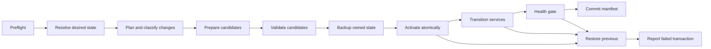

# T8 Design — Autonomous Deployment Orchestration / splitterctl

Status: ARCHITECT design against `main` @ `e922907`.

## 1. Scope and non-goals

T8 adds the deployment boundary only. The authoritative tunnel engine remains in `pkg/mux`, `pkg/session`, and `pkg/node`; no deployment package may be imported by `pkg/*`. The production surface is a thin `cmd/splitterctl` wrapper over internal deployment packages.

T8 composes T1–T5 rather than duplicating them:

- T1 `internal/pairing` owns blob encoding, parsing, validation, redaction, and secret/UUID/short-ID generation.
- T2–T3 `internal/xray` own pinned Xray installation, digest verification, Reality key generation, config rendering, `xray run -test`, and atomic activation.
- T4 `internal/origin` owns Caddy installation, Caddyfile rendering/validation/activation, CDN trust contracts, and origin status.
- T5 `internal/systemd` owns service-user provisioning, env files, unit rendering, unit verification, atomic unit application, health waits, pointer swaps, and unit removal/rollback.
- T6 `internal/firewall` is the only new host-firewall boundary.
- T7 `internal/deploy` owns desired-state planning, manifest/state persistence, transaction coordination, and rollback orchestration.
- T8 `cmd/splitterctl` owns argument parsing, operator-facing output, command dispatch, and exit status only.

The existing `install.sh` remains outside the T8 runtime path until T9. It must not become a second implementation of deployment behavior.

## 2. Hard prerequisite and release gate

The reported Linux run is red in the pre-existing product-engine stress test `pkg/node/budget_integration_test.go:269`, `TestAggregateBudgetStress200SessionsCarrierCycling`. The failure occurs while draining a 32 KiB cycle payload after 200 sessions and consumes approximately 322 seconds before an I/O timeout. This is not an acceptable T8 CI result.

Before T8 is called complete:

1. Reproduce the failure on Linux, preferably with and without `-race`, using the exact test and package.
2. Determine whether the cause is an engine defect in aggregate-budget/rebind progress or an invalid/non-deterministic test bound.
3. Add a deterministic regression test or correct the test synchronization/bound without using sleeps to hide a failure.
4. Run focused `pkg/node` tests, then the complete Linux suite and race suite.
5. Keep the result and disposition in `IMPLEMENTATION_STATUS.md`; do not weaken the existing gate or claim L4/L5 from a red run.

T8 code must not modify `pkg/node` as a convenience fix. If the investigation requires a product-engine change, it is an independently scoped prerequisite commit with its own review and tests.

## 3. Deployment roles and current API-compatible topology

### 3.1 Iran

The T8-compatible default manages:

- `iran-splitter.service` through `systemd.ComponentSplitter`.
- The Iran role env file through `systemd.WriteEnvFile`.
- Origin mode through `origin.OriginProvider` and, when applicable, `iran-origin.service` through `systemd.ComponentOrigin`.
- The project-owned firewall exposure for the selected origin mode.
- Pairing state and the tunnel secret in root-only files.

T5 currently rejects `systemd.ComponentXray` for `RoleIran`. Therefore T8 does not invent an `iran-xray.service` renderer or duplicate T5 unit logic. The default Iran integration is the user brief’s narrow external-Xray path: the user’s existing Xray/3x-ui remains external, and T8 can optionally apply a backed-up, previewable merge of only the required SOCKS outbound and routing rule. The full managed Iran Xray process and three-part dokodemo-door/vless/routing configuration described in the historical D2 section are explicitly deferred to T10.

External-Xray merge requirements for T8’s optional mode:

- Disabled by default unless an explicit flag is supplied.
- Detect and validate the target path; reject symlinks, unsafe paths, malformed JSON, duplicate/conflicting managed tags, and ambiguous inbound selection.
- Preview exact managed changes without displaying private keys or tunnel secrets.
- Back up the original file before mutation using a unique, root-only backup.
- Write a candidate beside the original, validate JSON and the external Xray test command where available, then atomically replace the original.
- Record only path, hash, backup reference, and managed-object identifiers in the manifest.
- On uninstall, remove only objects marked as project-owned and retain the original backup; never delete unrelated Xray configuration.
- A failed merge or restart is a failed deployment, not a warning-only success.

### 3.2 Germany

Germany is self-contained for the project-owned stack:

- install the pinned Xray binary through `xray.Installer.Install`;
- generate Reality parameters through `xray.GenerateRealityKeypair` using the installed binary;
- render and activate the Germany config through `xray.ActivateGermanyConfig` and its `run -test` gate;
- install the Germany splitter env file and unit through T5;
- install/apply `xray-germany.service` and `germany-splitter.service` with `After`/`Wants` relationships;
- apply the firewall boundary, exposing only the intended Reality port and protecting the local splitter port;
- health-check every activated component before committing state.

Reality private material never enters a pairing blob, manifest, log, CLI output after one explicit generation display policy, or Git artifact. Blob B contains only public parameters and the Germany down target.

### 3.3 Origin modes

- `caddy`: use `origin.New(origin.ModeCaddy, origin.Deps{...})`, install the pinned Caddy artifact, render/validate/activate the Caddyfile, and manage the Iran origin unit.
- `cdn`: use the existing CDN provider and require an explicit trust contract for TLS-origin mode; never silently downgrade origin authentication.
- `none`: only for local/fake tests; reject as a public deployment.

## 4. Package layout

### 4.1 `internal/firewall`

Files:

- `firewall.go`: types, provider interface, plan/result/error sentinels, ownership metadata.
- `ufw.go`: argv-based UFW adapter.
- `nftables.go`: argv-based nft adapter using a dedicated project table/chain.
- `fake.go`: deterministic fake for L1–L3.
- tests for diffing, conflicts, idempotence, rollback, malformed command output, and manager ambiguity.

Proposed boundary:

```go
type Manager interface {
    Detect(ctx context.Context) (Backend, error)
    Inspect(ctx context.Context, plan Plan) (Snapshot, error)
    Apply(ctx context.Context, plan Plan) (Result, error)
    Remove(ctx context.Context, ownership Ownership) error
}
```

`Plan` contains role, public ports, local ports that must not be exposed, optional CDN egress CIDRs, and an explicit backend policy (`auto`, `ufw`, `nftables`, `none`). It does not contain shell text. Every command uses structured argv through an injected executor.

Rules:

- Never flush a firewall, replace a host default policy, or delete an unrelated rule/table.
- `auto` fails closed if multiple active managers are detected with ambiguous ownership.
- UFW rules carry a stable project comment; nftables uses a dedicated table/chain with a stable marker.
- Inspect before apply. Existing equivalent rules are unchanged; only project-owned missing rules are added.
- Port conflicts are checked through the existing host-socket probe seam before mutation. An existing listener causes a guidance error, never displacement.
- `Remove` deletes only rules recorded as project-owned and verifies the postcondition.
- Failure after partial mutation invokes the provider’s inverse operation and returns a non-nil transaction error if restoration is incomplete.

### 4.2 `internal/deploy`

Files:

- `model.go`: role, desired state, current state, plan, step, result, and typed errors.
- `manifest.go`: schema, canonical encoding, hash/tamper envelope, atomic read/write, retention.
- `secrets.go`: root-only file references, permissions, fingerprints, redacted summaries.
- `planner.go`: desired-vs-current diff and destructive-change classification.
- `transaction.go`: preflight, prepare, validate, backup, activate, transition, health, commit, recovery.
- `pair.go`: orchestration over existing pairing APIs; no blob parsing duplicate.
- `doctor.go`: read-only diagnostics aggregator.
- `status.go`: bounded status snapshot.
- `fake.go`: injected filesystem/process/systemd/firewall/origin/Xray seams for L1–L3.

`internal/deploy` may import `internal/config`, `internal/firewall`, `internal/origin`, `internal/pairing`, `internal/systemd`, and `internal/xray`; it must not be imported by `pkg/*`.

## 5. Manifest and state design

The state root is `/etc/split-tunnel` in production and an injected temporary root in tests. The manifest is `/etc/split-tunnel/state.json`, mode `0600`, owned by root. Secret values are separate `0600` files and are represented by path plus a fingerprint only.

Canonical schema:

```json
{
  "schema": 1,
  "role": "iran|germany",
  "generation": "state-id",
  "createdAt": "RFC3339",
  "updatedAt": "RFC3339",
  "manifestHash": "sha256",
  "components": {
    "splitter": {"version":"...","path":"...","sha256":"..."},
    "xray": {"version":"...","path":"...","sha256":"..."},
    "origin": {"mode":"caddy|cdn|none","version":"...","domain":"..."}
  },
  "paths": {"stateRoot":"...","env":"...","config":"..."},
  "pairing": {"peerRole":"...","state":"none|a-generated|b-applied|finalized","fingerprints":[]},
  "services": [{"unit":"...","component":"...","hash":"..."}],
  "firewall": {"backend":"...","ownership":"...","rulesHash":"..."},
  "revisions": [{"id":"...","timestamp":"...","label":"...","snapshot":"revisions/...json"}]
}
```

No tunnel secret, Reality private key, pairing blob containing a secret, command output, or private key is serialized. The manifest hash is computed over canonical JSON excluding the hash field; the persisted envelope is validated on read. Manual edits produce a doctor warning and block mutating operations unless an explicit recovery command reconstructs state from owned artifacts.

Retain at most ten complete revision snapshots. A revision is committed only after health passes. Snapshot files are written atomically, mode `0600`, and are never pruned until the replacement manifest commit succeeds.

## 6. Transaction protocol

Every mutating operation follows the same state machine:



Rules:

1. Preflight performs privilege, platform, path, ownership, port, manager, input, and existing-state checks before destructive work.
2. Planning is pure and returns a diff. Unchanged desired state produces no writes and no service commands.
3. Preparation downloads/verifies/stages binaries and renders candidate configs/units. Existing T2–T5 validation gates run before activation.
4. Backups are created only for project-owned files or explicitly opted-in external-Xray targets. Backups are unique, root-only, bounded, and referenced by the pending transaction record.
5. Activation uses same-filesystem temp files and atomic rename/pointer operations. A crash-recovery journal records the phase and candidate paths before activation.
6. Service transitions are minimal and dependency ordered. No blanket `Restart=always` is added outside the canonical T5 renderer.
7. Health requires exact active state, config gates, expected sockets, origin/Xray probes, pairing consistency, and firewall postconditions.
8. Commit writes the new revision and manifest last. Only then are old revisions eligible for pruning.
9. Any failure invokes recovery from the previous committed revision. Recovery failure is surfaced as a distinct fatal error and leaves the journal for `doctor`; it is never reported as success.

Cancellation is checked between every step and before every external operation. Recovery receives a bounded context independent of the canceled apply context.

## 7. Pairing orchestration

Use only the existing constructors/parsers:

- Iran generates the tunnel secret with `pairing.GenerateTunnelSecret`, constructs Blob A with `pairing.NewBlobA(secret, uploadDomain)`, and stores the secret in a `0600` file before printing the blob once.
- Germany parses Blob A, validates the role and fields, provisions the Germany stack, generates Reality locally, constructs Blob B with `pairing.NewBlobB(pairing.PublicParams{...}, pairing.DownTarget{...})`, and prints B once.
- Iran parses Blob B, verifies the expected peer and public parameters, prepares the external-Xray merge or explicit operator instructions, and finalizes the manifest only after the down path health gate passes.

No deployment code reimplements checksum, base64, domain, UUID, short-ID, SNI, or tunnel-secret validation.

## 8. CLI surface

`cmd/splitterctl` uses a strict parser with explicit subcommands and no shell evaluation:

- `install iran|germany`
- `pair generate|apply|finalize`
- `status`
- `doctor`
- `upgrade [--xray|--origin|--splitter]`
- `rollback [--to state-id]`
- `uninstall [--purge]`
- `config show|set`

All mutating commands require root in production, reject unknown flags, and support non-interactive operation with explicit values/config input. Interactive prompting is CLI-only; `internal/deploy` receives a complete typed request. Secrets are accepted from protected files or stdin where possible, not ordinary command-line arguments. Output uses field names and redacted summaries; errors never echo values.

`status` is read-only and bounded. `doctor` is read-only and runs the fixed checklist from the architecture document, including manifest integrity, unit state, ports, config gates, Xray/origin state, pairing state, firewall ownership, permissions, disk/log capacity, clock skew, and known-issue hints.

## 9. Upgrade, rollback, uninstall

Upgrade is version-aware and candidate-first: download → verify → stage → validate → activate → restart the affected component → health → commit. A working version is never replaced before its candidate passes its own gate.

Rollback restores a retained revision, not a re-run of install with old flags. It restores version pointers, generated configs, env files, units, origin state, firewall-owned rules, and external-Xray merge backup/ownership state in dependency order, then performs the same health gate. Repeated rollback is idempotent and cannot consume the final known-good revision.

Uninstall requires explicit confirmation for destructive paths. It removes only project-owned units, pointers, binaries, generated configs, env files, origin artifacts, and marked firewall rules. It stops/disables services before removal, preserves revision/backup evidence until the operator purges it, and never deletes an external Xray file or unrelated firewall rule. `--purge` is separate and still retains or exports the external-Xray restoration backup before deletion of project metadata.

## 10. Doctor/status result model

Diagnostics return structured findings:

```go
type Finding struct {
    ID       string
    Severity Severity // pass, warn, fail
    Summary  string
    Action   string
    Redacted bool
}
```

The CLI renders a stable table; tests assert finding IDs and severity, not prose. A finding must be safe to print even when the target is hostile or malformed.

## 11. Test strategy

- L1: pure manifest canonicalization/tamper detection, planner diffs, transaction state machine, firewall rule parsing/diffing, CLI parser, secret redaction, path validation.
- L2: fake filesystem and injected T1–T5 adapters; verify generated artifacts, permissions, idempotence, service ordering, and no duplicate rules.
- L3: fault injection at download, checksum, extraction, config gate, origin activation, pointer swap, env write, unit apply, firewall apply, restart, health, cancellation, and crash-recovery journal points. Assert prior manifest/artifacts remain usable.
- L4: clean Linux host/container gate with real pinned Xray/Caddy gates preserved and fake or documented systemd shim where real systemd is unavailable.
- L5: staging deployment must be provisioned by `splitterctl`; do not claim L5 before installer-produced Germany/Iran state and the existing 20-scenario matrix pass.

The reported `pkg/node` failure is a separate prerequisite gate and must be green before T8 CI acceptance.

## 12. Review risks and decisions

- **CRITICAL 0:** no deployment import into `pkg/*`; no secrets/private keys in manifest; no non-transactional mutation; no firewall flush; no silent best-effort success.
- **HIGH 0:** every external executor has a fake seam; all candidate validation precedes activation; recovery is explicit; manager ambiguity fails closed; external-Xray changes are opt-in and backed up; T5 APIs are reused rather than duplicated.
- Historical D2 managed Iran-Xray design is not claimed by T8 because current T5 `RenderUnit` rejects Iran Xray components. It is a separately scoped T10 extension.
- Existing open issues #9, #10, #11, #12, #19, #20, and #21 remain open unless independently resolved and recorded. T8 does not close product-engine issues by implication.

### 12.1 Authoritative CI checkpoint

Browser verification of GitHub Actions run **Go #56** for commit `e922907` recorded:

- Job: `Linux build & test`.
- Result: **Failure**, total duration 5m57s.
- Failed step: ordinary `go test ./...`, before race and pinned gates.
- Failing package/test: `pkg/node`, `TestAggregateBudgetStress200SessionsCarrierCycling` at `pkg/node/budget_integration_test.go:314`.
- Symptom: `reading cycle payload: i/o timeout` after 322.42s; package duration 334.040s.
- Not reached: `go test -race`, Pinned Xray gate, Pinned Caddy gate, and build steps.

This is a release blocker, not an architecture finding. T8 implementation and completion claims remain gated on a focused, deterministic disposition of this pre-existing product-engine failure and a subsequent green Linux CI run.

## 13. Implementation sequence

1. Resolve and record the red `pkg/node` stress-test gate.
2. Implement and test `internal/firewall` with fake executor and Linux command adapters.
3. Implement manifest/state and planner with atomic writes, tamper detection, revisions, and crash journal.
4. Implement transaction coordinator around T1–T5 APIs and fake seams.
5. Implement status/doctor findings and read-only checks.
6. Implement pairing orchestration and explicit external-Xray merge boundary.
7. Implement thin `cmd/splitterctl` parser and command wiring.
8. Run focused tests, full tests, race tests, pinned gates, architecture review, then Linux CI.
9. Update `IMPLEMENTATION_STATUS.md` and this design with actual results; commit each focused phase and keep the tree clean.
